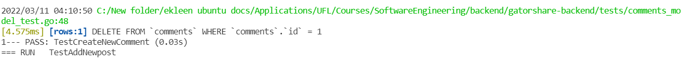

[](https://github.com/RTX2080-UF/gatorshare-backend/actions/workflows/main.yml)
# gatorshare-backend
Backend Code of GatorShare, Software Engineering Spring 2022 project.
Built by:
- Anuj Singh (Backend) {R3dI0}
- Dinesh Valasala (Frontend) {valasaladinesh}
- Ekleen Kaur (Backend) {eclairss17}
- Rishabh Tatiraju (Frontend) {tatirajurishabh}

Stack:
- Frontend: React.js
- Backend: GoLang
- Database: Postgres and sqlite

# GatorShare

College life is difficult, and expensive (unless you are Bill Gates' child). So, obviously, you'd want to save some money - let's say by sharing that cab ride to the airport (why would you even go there, though?), or maybe buy a large pizza and split the bill (and hopefully the pizza too) with different people. Whatever you want to do, GatorShare has you covered. Find people who want to share or split stuff with you and save money in the process. Wait, but its not just that, check out all that we offer below:

## User Features
### Ride Sharing
- Find people to share rides in their area. Our algorithm will automatically match people based on locality and their schedule flexibility.
- Plan rental cars together.
- Automatic email notification when a partner is found.
- You're under control: set limits on how many partners you are looking for. 

### Item Sharing
- Buy bulk items together like pizza, eggs, stationary and split among people.
- Subscribe to topics of your interest like perishables, gardening items, groceries, etc, and get notified when someone posts a share request.
- Order groceries together to bypass the minimum order limit. (We know you do it!)
- Share coupon codes to get additional discounts.

### Events
- Plan potlucks, group studies and much more!

## Enterprise features
KPIs available with a simple REST API:
- Riding patterns of people.
- Riding patterns of an area.

# Geek Zone
## Basic features
- User profiles: Login and registration.
- Community: Posts and comments, upvote and downvote users and posts.
- Notify: Push and email notifications.
- Follow: Create and subscribe to topics.

More features TBD...

# Setup and run instructions
1. First download and install go setup from *[here](https://go.dev/doc/install)*

2. Create an env file with following parameters
```
GIN_MODE: debug

# If you want to use sqlite
DB_TYPE: sqlite
DB_NAME: Db/share-v1.0-dev.db

# If you want to use postgres
DB_TYPE: postgres
DB_NAME: gatorshare
PG_USER: postgres
PG_PASSWORD: password
PG_HOST: localhost
PG_PORT: 5432

ACCESS_SECRET: "Gatorshare"
PORT: 8080
```

3. If you have Make tool install run
```
$ make server 
```
else you can directly run
```
$ go run main.go
```
4. You can check server status in terminal and website will be up onm port `8080` by default.
5. To run unit tests execute one of the below command depending on avialbility of make tool.
```
$ make test 
```
else you can directly run
```
$ go run ./tests
```

## Api Details (Documentation)
- [User Api Endpoints](./documentation/User_api.md)
- [Post Api Endpoints](./documentation/Posts_api.md)
- [Comment Api Endpoints](./documentation/Comment_api.md)

# Api endpoints

| Type | Api Endpoint | Description | Status |
| ----------- | ----------- | ----------- | ----------- |
| Get    | `/` | Home (Provide Server Status) | Active |
| Get    | `/v1/posts/getAll/:userId`       | Get all user post from user post ID | Active |
| Get    | `/v1/posts/getOne/:id`           | Get a single post by post ID | Active |
| Post   | `/v1/posts/create`               | Create a user post | Active |
| Patch  | `/v1/posts/update/:id`           | Update an existing post | Active |
| Delete | `/v1/posts/delete/:id`           | Delete an existing post by post ID | Active |
| Get    | `/v1/comments/getAll/:userId`    | Get all user comments from user comment Id | Active |
| Get    | `/v1/comments/getOne/:id`        | Get a single comment from user by Id | Active |
| Post   | `/v1/comments/create`            | Create a user comment | Active |
| Patch  |  `/v1/comments/update/:id`       | Update an existing comment | Active |
| Delete | `/v1/comments/delete/:id`        | Delete a user comment | Active |
| POST   | `/v1/users/register`             | Register new users | Active |
| POST   | `/v1/users/login`                | Authenticate and create user session | Active |
| GET    | `/v1/users/getUserProfile/:id`   | Get user profile by Id | Active |
| DELETE | `/v1/users/deleteProfile/:id`    | Delete user and associated resource | Active |
| PATCH  | `/v1/users/updateProfile/:id`    | Update user details | Active |
| GET    | `/v1/users/refreshToken`         | Reissue new authentication token | Active |
| GET    | `/v1/users/getProfile`           | Get current user profile | Active |
| POST   | `/v1/users/follow/:userId`       | Follow user with given userId | Active |
| GET    | `/v1/users/listFollowers/:userId`| List follower of user with given userId | Active |
| GET    | `/v1/tags/getOne/:tagId`         | Get tag with given tagId | Active |
| POST   | `/v1/tags/create`                | Create a new tag | Active |
| Patch  | `/v1/tags/update/:id`            | Update a tag details | Active |
| Delete | `/v1/tags/delete/:id`            | Delete a tag | Active |
| POST   | `/v1/tags/follow/:tagId`         | User can follow a tag with given tagId | Active |
| GET    | `/v1/users/resetPassword`        | Request for password reset for given email ID | Active |
| POST   | `/v1/users/updatePassword`       | Update forgotten password using reset token   | Active |
| GET    | `/v1/posts/getReactions/:postId` | Get user reactions/Interest on a Post         | Active |
| POST   | `/v1/posts/reactToPost`          | Allow user to add reaction/Interest to a Post | Active |
| GET    | `/v1/tags/popularTags/:count`    | Get N(count) most popular tags                | Active |
| GET    | `/v1/tags/selectTags`            | Select users Interest tags during on-boarding | Active |
| GET    | `/v1/notifications/getNew`       | Get latest notifications for User             | Active |
| GET    | `/v1/notifications/updateStatus` | Update notification read status               | Active |
| GET    | `/v1/home/user`                  | Get latest relevant post for user             | Active |
| GET    | `/v1/home/latest`                | Get latest common post                        | Active |
| GET  | `/v1/users/getFeedback/:userId`  | Return User Feedback                          | Active |
| POST | `/v1/posts/searchPost/`          | Search Post by Tags                           | Active |
# Unit test
[Unit tests](./tests/) are present in tests folder and could be excuted using make test

Working snippets of Unit Tests



