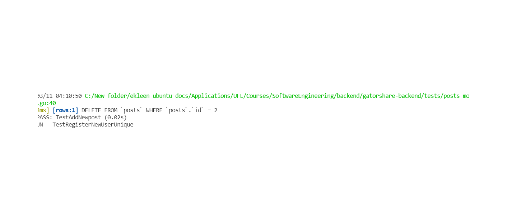

#### Postman
# gatorshare-backend
Backend Code of GatorShare, Software Engineering Spring 2022 project.
Built by:
- Anuj Singh (Backend) {R3dI0}
- Dinesh Valasala (Frontend) {valasaladinesh}
- Ekleen Kaur (Backend) {eclairss17}
- Rishabh Tatiraju (Frontend) {tatirajurishabh}

Stack:
- Frontend: React.js
- Backend: GoLang
- Database: Postgres and sqlite

## Sprint 2 Deliverables
We have attached git (#issue number) with corresponding feature implementation

- Extended functional and unit test cases (#71).
- Implemented user registration and login (#66). 
- Added session using JWT to existing and new API endpoints (#62).
- Created endpoints for adding, updating and deleting tags (#35). 
- Added option to specify interest using tags during on-boarding (#15).
- Users can now follow topics to get updates related to those tags (#34).
- Users can also now follow each other (#12). 
- Add Documentation for Sprint 3.

## Issues Resolved

## Api Endpoints features
GET- http://localhost:8080/  
Json Response received-  
    "data": "Welcome to Gatorshare made with the help of Go and Gin!"

## Api Details (Documentation)
- [User Api Endpoints](./documentation/User_api.md)
- [Post Api Endpoints](./documentation/Posts_api.md)
- [Comment Api Endpoints](./documentation/Comment_api.md)
- [Tag Api Endpoints](./documentation/Tag_api.md)

# Api endpoints delivered in this sprint 

| Type | Api Endpoint | Description | Status |
| ----------- | ----------- | ----------- | ----------- |
| GET | `/v1/users/refreshToken` | Reissue new authentication token | Active |
| GET | `/v1/users/getProfile` | Get current user profile | Active |
| POST | `/v1/users/follow/:userId` | Follow user with given userId | Active |
| GET | `/v1/users/listFollowers/:userId` | List follower of user with given userId | Active |
| GET | `/v1/tags/getOne/:tagId` | Get tag with given tagId | Active |
| POST | `/v1/tags/create` | Create a new tag | Active |
| Patch | `/v1/tags/update/:id` | Update a tag details | Active |
| Delete | `/v1/tags/delete/:id` | Delete a tag | Active |
| POST | `/v1/tags/follow/:tagId` | User can follow a tag with given tagId | Active |

# Unit test
[Unit tests](./tests/) are present in tests folder and could be excuted using make test

Working snippets of Unit Tests

# Functional test
[Functional test](./utils/) are created with the help of postman and they are present in utils folder with 
file name FunctionalTest.postman_collection.json