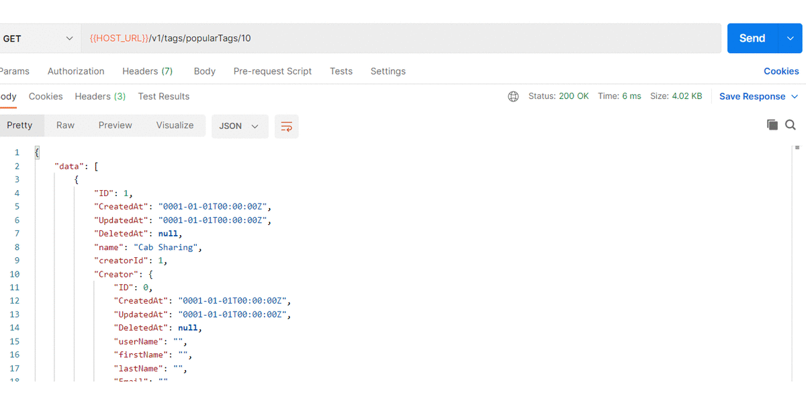

#### Postman

# gatorshare-backend (Description)
Gatorshare is a social media platform built to specifically cater to the need of international students. Users can come along and make plans for a trip or they can just post about buying and splitting stuff or resale their things. Using our app is straightforward a user firsts register to the platform and provide us with their basic Identification details and Interests, then the user creates a post based on their requirement, other users will receive notification about the new event nearby and they can now react on the posts to show their interest. Users have all the other basic functionality like maintaining their profile, getting email notifications, or just resetting their password. Apart from these users can enjoy other features like User rating/feedback and searching for relevant posts.   

Built by:
- Anuj Singh (Backend) {R3dI0}
- Dinesh Valasala (Frontend) {valasaladinesh}
- Ekleen Kaur (Backend) {eclairss17}
- Rishabh Tatiraju (Frontend) {tatirajurishabh}

Stack:
- Frontend: React.js
- Backend: GoLang
- Database: Postgres and sqlite

# Demo Video
## API working
https://user-images.githubusercontent.com/25840499/164370596-a2e24a1e-e0a4-484f-adb0-c719ff1529ed.mp4

## Functional Test & Unit Tests
https://user-images.githubusercontent.com/25840499/164371522-dcc21dad-baa8-4f80-b31e-3fa162cabc5f.mp4

# Sprint 4 

## Deliverables
[Sprint 4 Issues](https://github.com/RTX2080-UF/gatorshare-backend/issues?q=is%3Aissue+is%3Aclosed+milestone%3A%22Sprint+4%22)

Following are the git (#issue number) with corresponding feature implementation
- Forgot password option was added and password reset link through email is sent (#9).
- Users will now have updated posts on their homepage (#19).
- Email notification and get latest notification endpoint has been added (#80).
- User reactions on post is implemented to display interest (#81). 
- Users can now rate other users (#11).
- Users can search for post matching their specific interest (#34).
- Users can reply to other user comments (#6).
- Functional and unit test cases has been extended for new API endpoints.
- Added Documentation for Sprint 4.

## Issues Resolved
- Fixed create post to added newly generated tags with a post. 
- Updated login endpoint to return user details alongside with token.
- Updated update user profile endpoint to only update password if old password is provided.
 
## Application Public Url
[FrontEnd](https://gatorshare.netlify.app/)
[Backend](https://gatorshare.herokuapp.com/)
[Project Board](https://github.com/orgs/RTX2080-UF/projects/3)
```json
GET- http://localhost:8080/
Json Response
    "data": "Welcome to Gatorshare made with the help of Go and Gin!"
```

## Api Details (Documentation)
- [User Api Endpoints](./documentation/User_api.md)
- [Post Api Endpoints](./documentation/Posts_api.md)
- [Comment Api Endpoints](./documentation/Comment_api.md)
- [Tag Api Endpoints](./documentation/Tag_api.md)
- [Notification Api Endpoints](./documentation/Notification_api.md)
- [Home Api Endpoints](./documentation/Home_api.md)

# Api endpoints delivered in this sprint 
[Postman Collection](./utils/GatorShare.postman_collection.json)

| Type | Api Endpoint | Description | Status |
| ----------- | ----------- | ----------- | ----------- |
| GET  | `/v1/users/resetPassword`        | Request for password reset for given email ID | Active |
| POST | `/v1/users/updatePassword`       | Update forgotten password using reset token   | Active |
| GET  | `/v1/posts/getReactions/:postId` | Get user reactions/Interest on a Post         | Active |
| POST | `/v1/posts/reactToPost`          | Allow user to add reaction/Interest to a Post | Active |
| GET  | `/v1/tags/popularTags/:count`    | Get N(count) most popular tags                | Active |
| GET  | `/v1/tags/selectTags`            | Select users Interest tags during on-boarding | Active |
| GET  | `/v1/notifications/getNew`       | Get latest notifications for User             | Active |
| GET  | `/v1/notifications/updateStatus` | Update notification read status               | Active |
| GET  | `/v1/home/user`                  | Get latest relevant post for user             | Active |
| GET  | `/v1/home/latest`                | Get latest common post                        | Active |
| POST | `/v1/users/addFeedback`          | Add User Feedback and Update User Rating      | Active |
| GET  | `/v1/users/getFeedback/:userId`  | Return User Feedback                          | Active |
| POST | `/v1/posts/searchPost/`          | Search Post by Tags                           | Active |

# Backend Tests
## Unit test
[Unit tests](./tests/) are present in tests folder and could be excuted using make test

## Functional test
 
Functional test are created with the help of postman and they are present in [utils folder](./utils/FunctionalTest.postman_collection.json)
